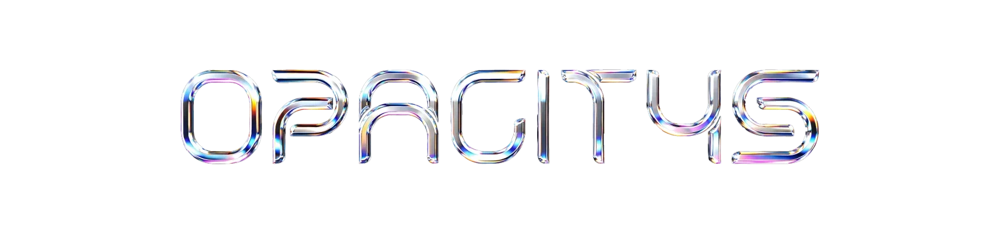
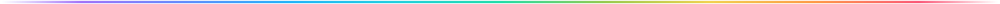
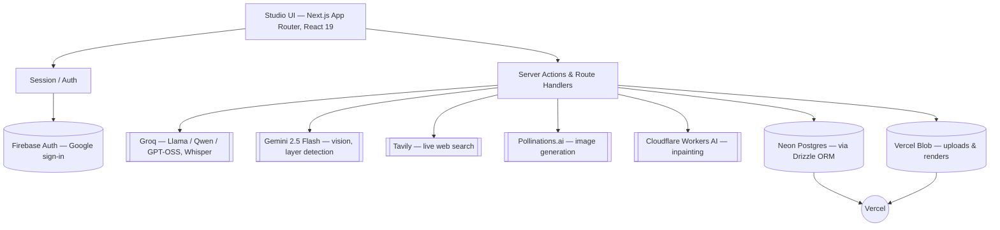

<div align="center">
  

  <p>
    <em>Everything between Vision and Design.</em>
  </p>

  <p>
    
    
    
    
    
    
    
  </p>

  <p>
    <a href="https://opacitys.vercel.app"><strong>opacitys.vercel.app »</strong></a>
  </p>
</div>



Opacitys is a creative workspace that simplifies every stage of the graphic design process, from inspiration to execution. Ten measurement-grounded tools, one idea: take something faint and bring it up until it is fully there — every claim backed by a real number or a real source, never a guessed adjective.

### Contents

- [The idea](#the-idea)
- [Features](#features)
- [How it works](#how-it-works)
- [Tech stack](#tech-stack)
- [Getting started](#getting-started)
- [Project structure](#project-structure)
- [Design language](#design-language)


## The idea

The name is the interface. Opacity is clarity — every design starts faint: a half-formed idea at 10%, a brief you can almost read, a client note you cannot picture. The work is bringing it up, layer by layer, until it is fully there at 100%.

| Opacity | Stage | What's happening |
|:---:|---|---|
| `██░░░░░░░░` 10% | **The faint idea** | You can sense the design before you can describe it. Nothing is wrong yet — it is simply not visible. |
| `████░░░░░░` 40% | **Reference and direction** | Shapes settle. You know the register you are working in, and which way is forward. |
| `███████░░░` 70% | **Structure and craft** | Type finds a scale, the grid appears, spacing starts to breathe on purpose. |
| `██████████` 100% | **Fully resolved** | Every decision has a reason you could defend out loud, to a client or to yourself. |

Ten tools, each one turning a specific kind of faintness into something measured:

- The brief arrives blurry → **Route** turns it into an ordered plan
- Feedback comes in vague → **Critique** turns it into numbers pinned to pixels
- The reference moves → **Currents** reads what's actually moving, right now
- You cannot see your own work → **Fingerprint** tracks it over time, so you don't have to guess

## Features

All ten modules are wired end to end — nothing here is a mockup.

| | Module | What it does |
|---|---|---|
| 🔎 | [**Critique**](#critique) | See what is actually working |
| 🧱 | [**Rebuild**](#rebuild) | Take a design apart, then change it by asking |
| 🧬 | [**Identify**](#identify) | Name the style, in proportion |
| 📈 | [**Currents**](#currents) | Read the room, and the reason |
| 🗺️ | [**Route**](#route) | From brief to build, with what you actually have |
| 🛠️ | [**Instruments**](#instruments) | Know where everything is |
| 💬 | [**Correspondence**](#correspondence) | The whole client relationship, in one thread |
| 🧭 | [**Originality**](#originality) | Check it's yours before you spend a week |
| 🫆 | [**Fingerprint**](#fingerprint) | Your style, recorded over time |
| ⚖️ | [**Clearance**](#clearance) | Know what's actually yours to use |

<br>

<a id="critique"></a>
<details open>
<summary><strong>🔎 Critique</strong> — See what is actually working</summary>

Upload a design and get it read back to you in measurements — contrast ratios, type scale, alignment, spacing rhythm — each one pinned to the exact place on the image it came from.

| | |
|---|---|
| **Input** | A finished or in-progress design, as an image |
| **Output** | Every flaw pinned to its exact spot, with a measured number instead of an adjective |

1. Runs deterministic measurements — contrast ratios, type scale, alignment, spacing rhythm
2. A model reads those measurements and explains what each one means for the design
3. Findings land directly on the image, with a score per dimension

</details>

<a id="rebuild"></a>
<details>
<summary><strong>🧱 Rebuild</strong> — Take a design apart, then change it by asking</summary>

Upload a poster, a logo, a screen. Opacitys finds the real elements inside it — the logo, each block of type, each button — names them, and nests them under the sections they sit in. Point at one, describe the change you want, and it redraws just that part — everything else, including transparency, stays exactly as it was. Every version is kept.

| | |
|---|---|
| **Input** | An image of a poster, logo, or finished screen |
| **Output** | Its elements found and named, and a redrawn version for any change you describe |

1. Finds the real elements — logo, type, buttons, imagery — and nests them under the sections they belong to
2. Select a layer, or drag a box over any part of the image, and describe the change in plain language
3. Redraws just that part at full resolution and keeps it as a named version — everything outside it, including transparency, stays untouched

</details>

<a id="identify"></a>
<details>
<summary><strong>🧬 Identify</strong> — Name the style, in proportion</summary>

Most designs are a blend, not a category. This reads an image against a labelled taxonomy and tells you the mix — sixty percent Swiss, thirty brutalist, ten editorial — with the same answer every time you ask.

| | |
|---|---|
| **Input** | Any design image |
| **Output** | The style mix behind it, as percentages — not a single guessed label |

1. Reads the image against a labelled taxonomy of over a hundred design styles
2. Scores how strongly each style is present
3. Returns the blend — say, sixty percent Swiss, thirty brutalist, ten editorial

</details>

<a id="currents"></a>
<details>
<summary><strong>📈 Currents</strong> — Read the room, and the reason</summary>

Name a category, platform or brand and it searches the live web — within the window you pick — for what's actually moving, where it came from, why it's catching on, and how to execute it. Every claim is pinned to the page it came from.

| | |
|---|---|
| **Input** | A category, platform, or brand you want a read on, and how far back to look |
| **Output** | Named, distinct currents — what they look like, why they caught on, how to execute them, and the sources |

1. Searches the live web for recent, dated writing on that scope
2. Names 3-5 distinct currents, each traced to where it came from and why it's catching on now
3. Turns each into concrete execution steps, with every claim linked back to its source

</details>

<a id="route"></a>
<details>
<summary><strong>🗺️ Route</strong> — From brief to build, with what you actually have</summary>

Give it the client's specifications, your resources and your current skills. It returns practical directions — including ones you have not tried — as an ordered plan naming the tool and the step for each stage. Ask it anything about the plan afterward — it can explain itself, or fix a step that's genuinely wrong.

| | |
|---|---|
| **Input** | A client brief, plus the tools and skills you actually have |
| **Output** | An ordered plan naming which tool does which step |

1. Reads the brief for what it is actually asking for
2. Matches it against your stated resources and skill level
3. Returns a practical route, including approaches you may not have tried

</details>

<a id="instruments"></a>
<details>
<summary><strong>🛠️ Instruments</strong> — Know where everything is</summary>

Attach a screenshot and it reads your actual screen to point at the real control. Ask without one and it searches current docs and changelogs instead — either way, the answer is grounded in something live, not a stored guess.

| | |
|---|---|
| **Input** | A question about a tool, or a screenshot of one |
| **Output** | Where the control actually is, or what a live search of current docs found |

1. A screenshot is read directly against what's actually visible — no search, no stored knowledge
2. Without one, it searches current docs, changelogs and help centres instead
3. Every research-path claim links back to the page it came from; repeat questions are served from a week-long cache

</details>

<a id="correspondence"></a>
<details>
<summary><strong>💬 Correspondence</strong> — The whole client relationship, in one thread</summary>

Log what the client said, when, and through which channel. Track how many rounds a project has been through, how long each turnaround took, and what you charged for it — with every message readable back into what they probably mean and a reply you could send.

| | |
|---|---|
| **Input** | What the client said, plus the channel, iteration and price |
| **Output** | A running log of the relationship — timing, cost, and what each note actually meant |

1. Logs every client message with its timestamp, channel and iteration number
2. Tracks turnaround time and price per round, so the history is evidence, not memory
3. Reads any entry back into concrete moves, trade-offs, and a reply you could send

</details>

<a id="originality"></a>
<details>
<summary><strong>🧭 Originality</strong> — Check it's yours before you spend a week</summary>

Describe the direction — or attach a sketch — and get a read on how crowded that territory already is: the movements and work it sits closest to, what's genuinely distinct about it, and moves that would put more daylight between you and the nearest neighbor.

| | |
|---|---|
| **Input** | A direction you're considering, described in words, plus an optional sketch |
| **Output** | How crowded that space is, its nearest neighbors, and what's distinct about yours |

1. Reads the direction — and the image, if you attach one — against widely-documented movements and work
2. Names the closest neighbors and why they're close, not just a single verdict
3. Suggests concrete moves that would widen the gap, and says plainly when it isn't sure

</details>

<a id="fingerprint"></a>
<details>
<summary><strong>🫆 Fingerprint</strong> — Your style, recorded over time</summary>

Every Critique, Identify and Originality read you've run, aggregated into one record — the styles you keep returning to, your measured strengths and recurring notes, the palette you reach for. Nothing here is guessed; a dimension without enough signal says so instead of scoring zero.

| | |
|---|---|
| **Input** | Your uploads — nothing new to provide |
| **Output** | Your measured style, craft scores and palette, plus recurring notes across everything you've made |

1. Aggregates every completed Critique, Identify and Originality run into one record
2. States plainly when a dimension doesn't have enough signal yet, rather than scoring it zero
3. Turns the aggregate into a short written read, only when you ask for one

</details>

<a id="clearance"></a>
<details>
<summary><strong>⚖️ Clearance</strong> — Know what's actually yours to use</summary>

General, durable principles on public domain, licensing and work-for-hire, plus a country-aware answer to a specific question about a font, image, or asset — always with a plain reminder that this is guidance, not legal advice.

| | |
|---|---|
| **Input** | A question about an asset, plus the country you're working from |
| **Output** | General guidance on what's free to use commercially and what needs a license |

1. Starts from durable principles — public domain, licensing, work-for-hire — that don't shift by jurisdiction
2. Reads your question against the general pattern in the country you name
3. Says plainly when something is too specific or too likely to have changed to answer with confidence

</details>

## How it works

Every module follows the same shape: real measurement or a live source first, a model second to explain what it means — never the other way around.



**Rebuild**, the most involved module, is the clearest example: Gemini grounds the image into named, nested elements; a scoped edit crops out only the selected element, sends it (with the full design as reference) to Pollinations or Cloudflare Workers AI, and composites the result back at full resolution — so a one-word text fix on a 6000px logo comes back at 6000px, with everything else, including the source's own transparency, pixel-identical outside the edited box. Text edits skip the image model entirely: the exact string, color, weight and cap-height are measured from the pixels, the new glyphs are rendered from real outline fonts, and only then composited in.

## Tech stack

| | |
|---|---|
| **Framework** | Next.js 16 (App Router), React 19 |
| **Language** | TypeScript |
| **Styling / motion** | Tailwind CSS v4, Motion |
| **Database** | PostgreSQL (Neon) via Drizzle ORM |
| **Auth** | Firebase Auth (Google sign-in) |
| **Storage** | Vercel Blob |
| **AI — reasoning & text** | Groq (Llama / Qwen / GPT-OSS, Whisper for voice) |
| **AI — vision** | Google Gemini 2.5 Flash |
| **AI — web search** | Tavily |
| **AI — image generation / editing** | Pollinations.ai, Cloudflare Workers AI |
| **Deployment** | Vercel |

Every provider above has a genuinely free tier — no card required at any tier used by this app.

## Getting started

```bash
git clone https://github.com/Vaibhav-Reddy560/Opacitys.git
cd Opacitys
npm install
cp .env.local.example .env.local   # fill in the keys below
npm run dev
```

| Variable(s) | Needed for |
|---|---|
| `DATABASE_URL` | Postgres (Neon) |
| `BLOB_READ_WRITE_TOKEN` | Vercel Blob storage |
| `SESSION_SECRET` | Session cookie signing |
| `NEXT_PUBLIC_FIREBASE_*`, `FIREBASE_*` | Google sign-in (client + admin) |
| `GROQ_API_KEY` | Critique, Identify, Originality, Route, Instruments, voice transcription |
| `GEMINI_API_KEY` | Rebuild — layer detection |
| `POLLINATIONS_API_KEY` | Rebuild — image editing |
| `CLOUDFLARE_ACCOUNT_ID`, `CLOUDFLARE_API_TOKEN` | Rebuild — inpainting fallback |
| `TAVILY_API_KEY` | Currents — web search |
| `DRIBBBLE_CLIENT_ID/SECRET`, `PORTFOLIO_TOKEN_KEY` | Fingerprint — optional portfolio link |

Full context and sign-up links for every key live in [`.env.local.example`](.env.local.example).

## Project structure

```
src/
├── app/          # Routes (App Router) — studio/*, api/*, login, signup
├── components/   # UI, grouped by feature — critique/, rebuild/, studio/, brand/, ...
└── lib/          # Business logic, grouped the same way — measure/, rebuild/, trends/, ...
drizzle/          # SQL migrations
scripts/          # Regression tests, asset pipelines (font builds, provider probes)
public/           # Static assets, fonts
```

## Design language

The interface is built on the same idea as the product: a prism splitting white light into bands. Every Critique dimension — hierarchy, color, rhythm, typography, layout, contrast, spacing, balance, restraint — maps to a fixed point on one continuous spectrum, ordered by descending hue so it always reads as a single clean ramp rather than an arbitrary palette. That ramp is the accent color on every rule, meter and rail across the app — including the one on this page.


<div align="center">
  <h3>Bring it up to one hundred.</h3>
  <p><em>Start with whatever you have — a photo, a half-finished file, a brief you do not understand yet.<br>Faint is a perfectly good place to begin.</em></p>
  <p><a href="https://opacitys.vercel.app"><strong>Open the studio »</strong></a></p>
</div>
